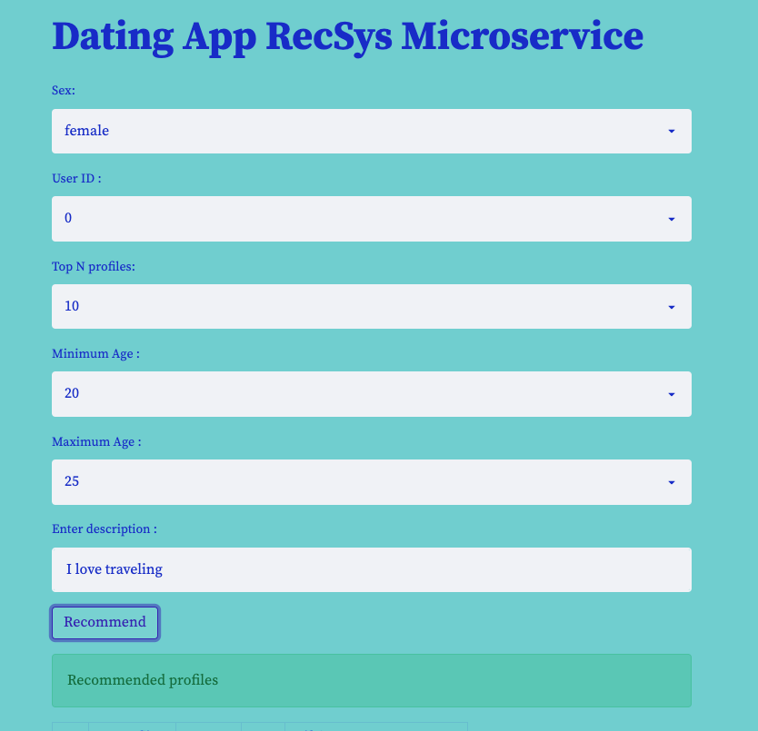

# Dating Application Recommendation System

For many users, the idea of sorting through hundreds of dating profiles to find potential matches seems daunting and time-consuming.
This automated system  recommends profiles of other users that a user will like!

## Application's archiecture

### The steps for installation:

1. Clone this repo to your local machine
2. pip install -r requirements.txt
$ streamlit run app.py

## Dataset

[OkCupid Kaggle](https://www.kaggle.com/datasets/andrewmvd/okcupid-profiles)

## Quick GIF demo:

