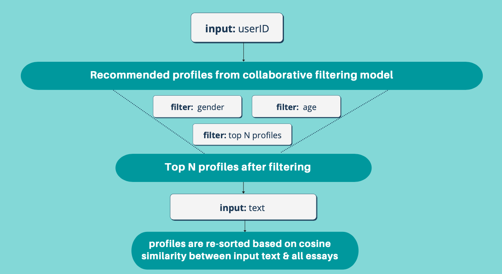

# Dating Application Recommendation System

For many users, the idea of sorting through hundreds of dating profiles to find potential matches seems daunting and time-consuming.
This automated system  recommends profiles of other users that a user will like!
We're turning a cold-start problem into a user to item problem by calculating similarity vectors between new and existing users' data. We then apply additional filtering and also TF-IDF for the text-based inputs to recommend profiles based on the comprehensive method.


## Application's archiecture




### The steps for installation:

Clone this repo to your local machine

```
pip install -r requirements.txt
```
```
streamlit run app.py
```


## Dataset

[OkCupid dataset from Kaggle](https://www.kaggle.com/datasets/andrewmvd/okcupid-profiles)


## Quick GIF demo:


